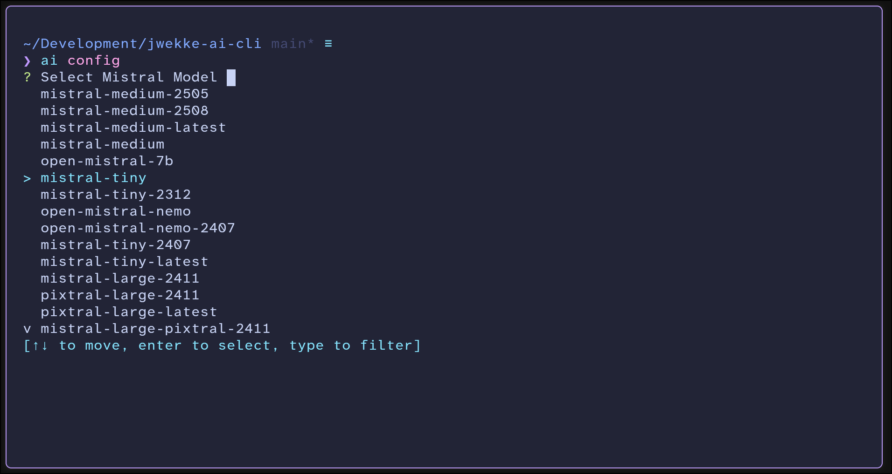
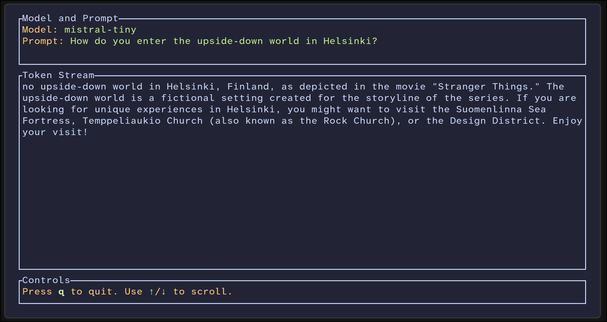

# jwekke-ai-cli

A yet another "worse than already available" cli tool for running Mistral AI models from terminal. Poorly optimized, some bugs in buffer stitching. Needs also looking into formatting the markdown from stream.

Supports model selection and streaming output. Uses [ratatui](https://ratatui.rs/) for TUI.




## Development

set `MISTRAL_API_KEY` into environment variables

See [console.mistral.ai)(https://console.mistral.ai/) for api management.

```sh
export MISTRAL_API_KEY="your_api_key_here"
```

```sh
cargo run -- "What is the meaning of life, 50 characters with markdown, first word bolded."
```

## Installation (compile)

1. Clone
```sh
git clone https://github.com/jwekke/jwekke-ai-cli.git
cd jwekke-ai-cli
```

2. Compile binary & store

```sh

cargo install --path .
# add to PATH if not already
# export PATH="$PATH:$HOME/.cargo/bin"
```

or 

```sh
git clone https://github.com/jwekke/jwekke-ai-cli.git
cd jwekke-ai-cli
cargo build --release
sudo cp ./target/release/jwekke-ai-cli /usr/local/bin/ai # <-- note the renamed binary!
```

## Usage

```sh
jwekke-ai-cli --help
# or if you renamed it
ai --help
```

## Prompt

```sh
ai run "Where do you store ketchup in a finnish household?"
```

## Config

The config file is created into `~/.config/jwekke-ai-cli/config.jwek`.

```sh
jwekke-ai-cli config
# or if you renamed it
ai config
```

Outputs interactive model selection based from `api.mistral.ai/v1/models`.

```
~/Development/jwekke-ai-cli main* ≡
❯ ai config
? Select Mistral Model  
> mistral-medium-2505
  mistral-medium-2508
  mistral-medium-latest
  mistral-medium
  open-mistral-7b
  mistral-tiny
  mistral-tiny-2312
  open-mistral-nemo
  open-mistral-nemo-2407
  mistral-tiny-2407
  mistral-tiny-latest
  mistral-large-2411
  pixtral-large-2411
  pixtral-large-latest
v mistral-large-pixtral-2411
[↑↓ to move, enter to select, type to filter]
```

## Example

```sh
mistral "What is the meaning of life, 50 characters with markdown, first word bolded."
```

## Output

```markdown
**The** meaning of life is a profound question that has been debated for centuries. In 50 characters: "Life's purpose is to find happiness and meaning."
```
